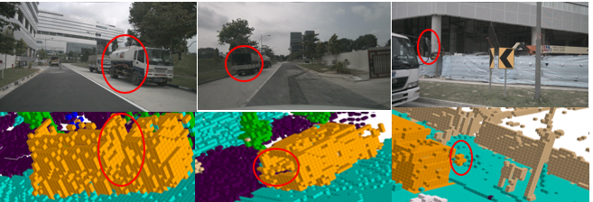

# Occupancy Dataset for nuScenes

Camera-based detection has recently made a huge breakthrough, and researchers are ready for the next harder challenge: occupancy predicton.

Occupancy is not a new topic, and there have been some related studies before (MonoScene, SemanticKitti). However, the existing occupancy datasets still have shortcomings. There is a huge gap between the sparse occupancy annotations generated by limited point clouds and the image modality. In order to promote the learning about occupancy, we take a small step forward.

In this project, we use the nuScenes dataset as the base, and for each frame, we align the point cloud of the front and rear long-term windows to the current timestamp. Based on this dense point cloud, we can generate high-quality occupancy annotations. It is worth mentioning we perform independent alignment for dynamic objects and static objects.

# Dadaset


https://user-images.githubusercontent.com/38872184/219947507-fda736e6-2925-4821-a530-9203c135a031.mp4




The occupancy label no longer uses simple bounding boxes to represent objects, and each object has an occupancy label corresponding to its real shape.
# Prediction


## Installation
1. Create conda environment with python version 3.8

2. Install pytorch and torchvision with versions specified in requirements.txt

3. Follow instructions in https://mmdetection3d.readthedocs.io/en/latest/getting_started.html#installation to install mmcv-full, mmdet, mmsegmentation and mmdet3d with versions specified in requirements.txt

4. Install timm, numba and pyyaml with versions specified in requirements.txt

## Preparing
1. Download pretrain weights from https://github.com/zhiqi-li/storage/releases/download/v1.0/r101_dcn_fcos3d_pretrain.pth and put it in ckpts/

2. Create soft link from data/nuscenes to your_nuscenes_path

3. Follow the mmdet3d to process the data.

4. Generate occupancy data
``` 
python data_converter.py --dataroot ./project/data/nuscenes/ --save_path ./project/data/nuscenes/occupancy/ 
```
## Train
```
cd project
bash launcher.sh config/occupancy.py out/occupancy 
```
[ckeckpoints](https://drive.google.com/file/d/1jY2JJcNzkfJd1Q7A42vLlT_Y23e_90kD/view?usp=sharing)
# Model

We designed a naive occupancy prediction model based on BEVFormer as the baseline.

Similar to BEVFormer, Occupancy-BEVFormer network has 3 encoder layers, each of which follows the conventional structure of transformers, except for three tailored designs, namely BEV queries, spatial cross-attention, and  self-attention. Specifically, BEV queries are grid-shaped learnable parameters, which is designed to query features in BEV space from multi-camera views via attention mechanisms. Spatial cross-attention and self-attention are attention layers working with BEV queries, which are used to lookup and aggregate spatial features from multi-camera images, according to the BEV query. Since the BEVfeature is two-dimensional, an embedding in the z-axis direction is added to turn it into a three-dimensional space feature, and then a convolutional neural network is used to generate the semantics of each position in the three-dimensional space.


## Evaluation Metrics

### mIoU

Let $C$ be he number of classes. 

$$
    mIoU=\frac{1}{C}\displaystyle \sum_{c=1}^{C}\frac{TP_c}{TP_c+FP_c+FN_c},
$$

where $TP_c$ , $FP_c$ , and $FN_c$ correspond to the number of true positive, false positive, and false negative predictions for class $c_i$.
### Results in val set

| barrier | bicycle | bus | car | construction_vehicle | motorcycle | pedestrian | traffic_cone | trailer |  truck | driveable_surface | other_flat | sidewalk | terrain | manmade | vegetation |  miou |
| -- | --|--| -- | --|--|--|--|--|--|--|--| --|----------------------|---|------ | -------------------------------- |
| 15.12 | 8.55 | 28.78 | 28.06 | 10.36 | 13.42 | 9.22 | 4.57 | 17.38 | 22.56 | 48.38 | 22.57 | 29.11 | 25.81 | 16.22 |20.77 | 20.056  |
### Results in mini-val set

| barrier | bicycle | bus | car | construction_vehicle | motorcycle | pedestrian | traffic_cone | trailer |  truck | driveable_surface | other_flat | sidewalk | terrain | manmade | vegetation |  miou |
| -- | --|--| -- | --|--|--|--|--|--|--|--| --|----------------------|---|------ | -------------------------------- |
| \ | 14.67 | 44.13 | 33.06 | 0.00 | 20.41 | 11.12 | 1.18 | 0.00 | 29.94 | 46.69 | 0.65 | 29.67 | 18.77 |19.14 | 23.96  | 19.559
 |

[**clik here download mini occupancy dataset for nuscenes v1.0-mini**](https://drive.google.com/file/d/1n48IIy1poOOusHujyGhuDx_QZkPeI6ki/view?usp=sharing)

The full dataset is coming soon.

## Acknowledgement

Many thanks to these excellent open source projects:

- [open-mmlab](https://github.com/open-mmlab)
- [BEVFormer](https://github.com/fundamentalvision/BEVFormer)
- [TPVFormer](https://github.com/wzzheng/TPVFormer)

Most thanks to nuscenes dataset:
- [nuscenes](https://www.nuscenes.org/nuscenes)
